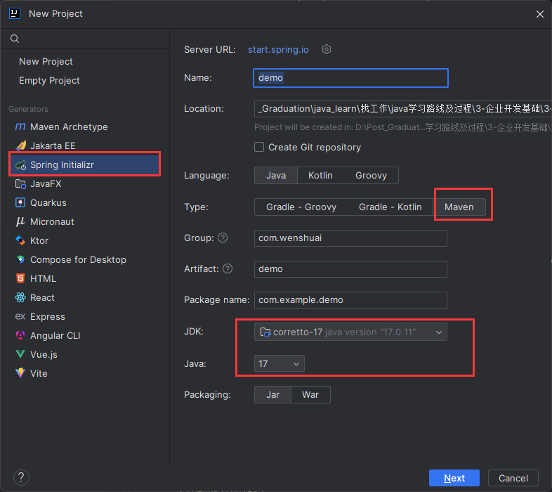
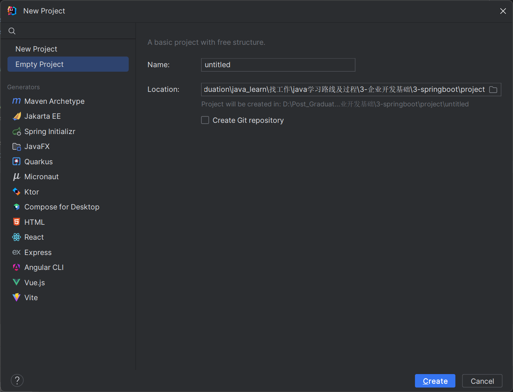
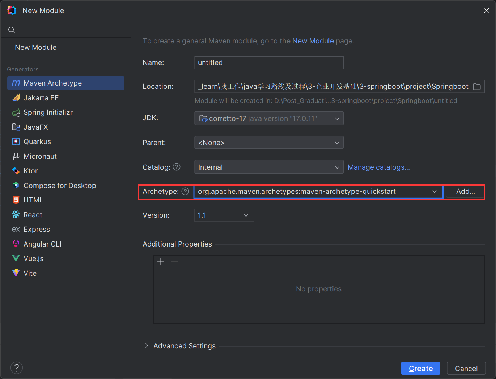
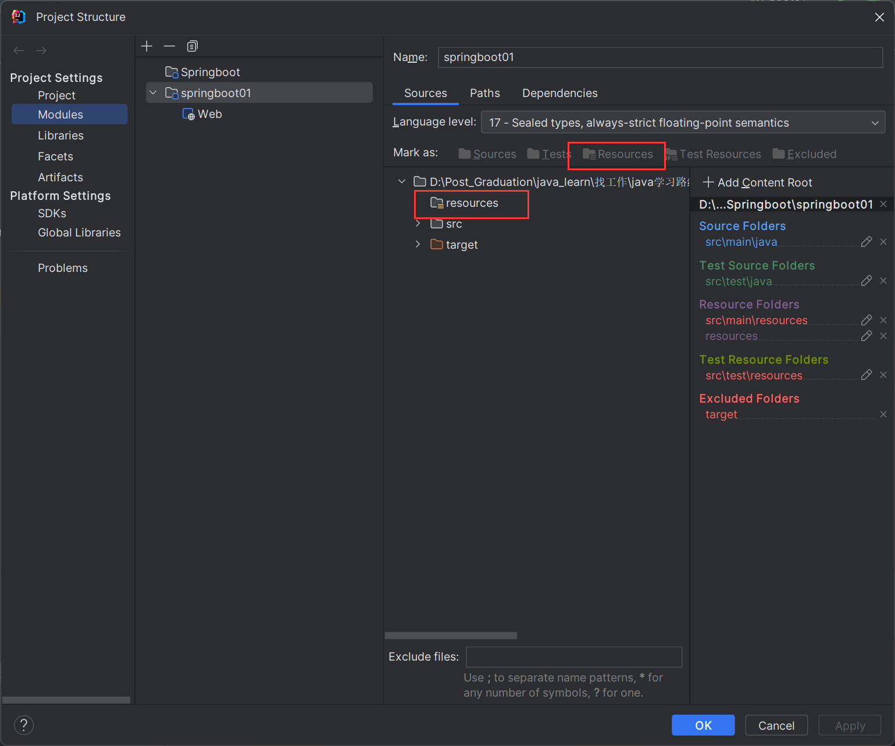
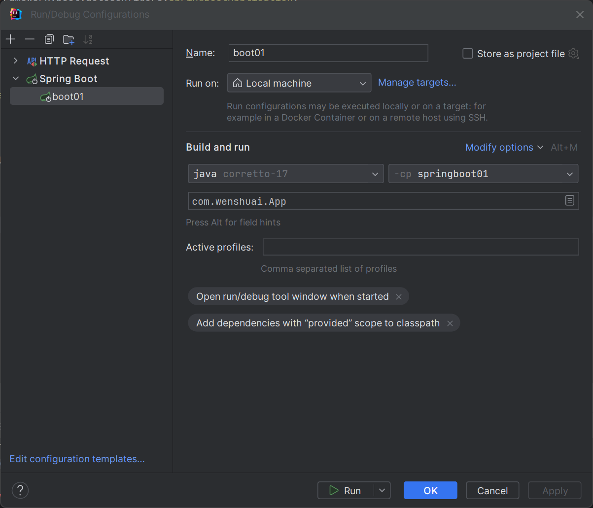
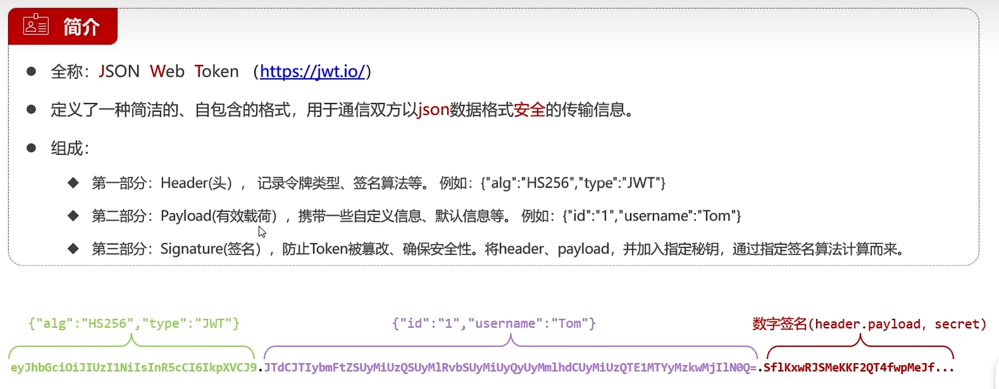
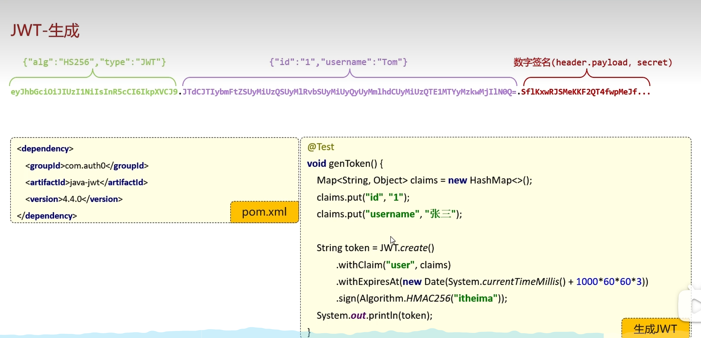
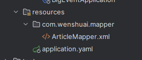
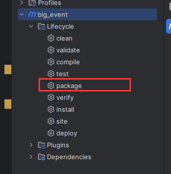
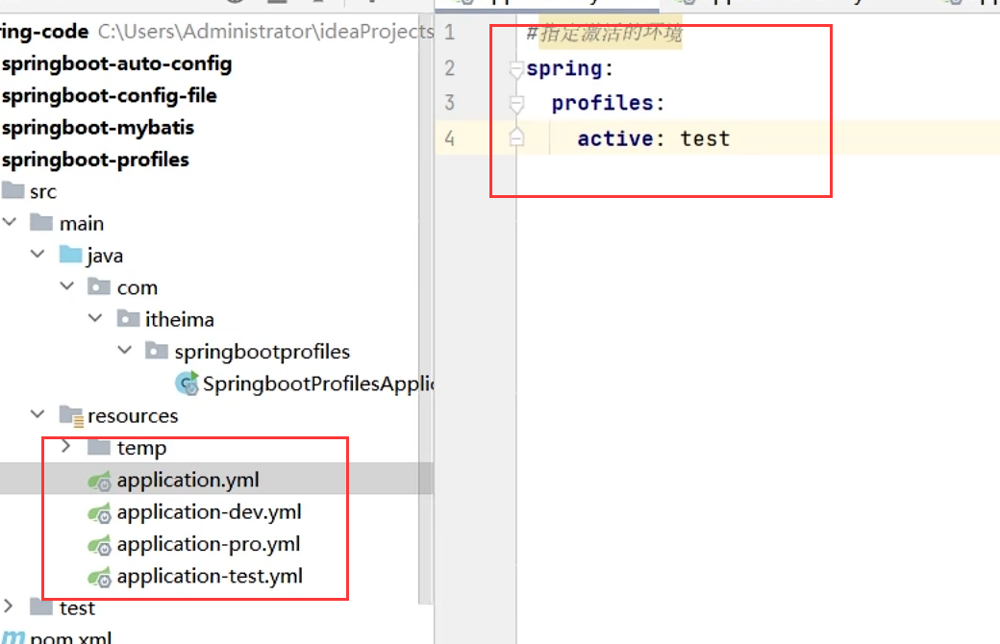

# Springboot3+Vue3学习

## 一、Springboot3学习基础篇

### 1、入门

在idea中使用Springinitializer进行快捷搭建框架。需要注意的是在选择Spring版本和java版本的时候，需要注意他们之间的对应关系。就比如这里的Springboot3就需要java17版本。后面别忘了选择 Spring web项目。



如果进来之后发现maven十分卡顿，那么大概率是Springboot的版本不是很适配，在云服务器上找不到，可以考虑换一个版本。

可以看到如下信息，这个信息说明了，此项目的maven是继承自spring-boot-starter-parent3.1.11项目的，这有什么用呢？maven的继承关系，其实就是免得自己再去重复的写那些依赖，并且保证这些依赖之间版本是协调的， 避免了版本冲突。在后面引入Spring相关的起步依赖的时候，不需要去写版本号，这个父工程会为我们管理。

```xml
	<parent>
        <groupId>org.springframework.boot</groupId>
        <artifactId>spring-boot-starter-parent</artifactId>
        <version>3.1.11</version>
        <relativePath/> <!-- lookup parent from repository -->
    </parent>
```

创建一个最简单的Springboot项目流程：

+ 创建一个Springboot web项目，选择对应的Springboot版本和jdk版本；
+ 确定maven没有问题；
+ 编写controller，直接执行即可；
+ Springboot内嵌了tomcat，不需要做额外的配置

### 2、手动创建Springboot工程

首先是创建一个空工程，什么都不用选择，这个工程作为本次学习的父工程。



然后新建一个模块，这个模块会自动属于这个父工程下。注意创建一个maven模块。工程的骨架选择快速骨架。



之后就是为这个模块确定其父工程，其实就是Springbootparent，这个Springbootparent可以做一些依赖的版本管理，因此我们在后面引入Springboot相关配置时，不需要再加上版本号。导入相关基本依赖

```xml
  <parent>
    <groupId>org.springframework.boot</groupId>
    <artifactId>spring-boot-starter-parent</artifactId>
    <version>3.1.11</version>
  </parent>
  <dependency>
      <groupId>org.springframework.boot</groupId>
      <artifactId>spring-boot-starter-web</artifactId>
  </dependency>
  
```

依赖处理完毕了，现在需要把Springboot的启动类改一下。创建maven工程的时候，我们会自动为我们创建一个main函数作为程序入口，我们需要在那里改一下。

```java
package com.wenshuai;

import org.springframework.boot.SpringApplication;
import org.springframework.boot.autoconfigure.SpringBootApplication;

/**
 * Hello world!
 *
 */
@SpringBootApplication
public class App 
{
    public static void main( String[] args ){
        SpringApplication.run(App.class, args);

    }
}
```

由于我们创建的是一个maven项目，不是webapp项目，因此没有resource文件，此时需要手动创建一个，并且在项目结构中将其指定为资源文件夹。最后需要在这个文件夹里创建好一个Springboot基本的配置文件，application.properties文件。



终于到了最后一步，进行运行配置。新建一个运行，选择Springboot的运行，然后选择运行的java版本和模块，选择启动类，执行即可。恭喜你，大功告成了！



### 3、配置文件

两种配置文件，properties或者yaml配置文件。我们主要使用的是application.yaml配置文件；yaml配置文件中：

+ 第三方技术配置信息，比如redis、
+ 自定义配置信息，如果直接将信息写入代码当中，非常麻烦，一旦信息发生修改，需要重新编译打包测试部署；如果将信息写在配置文件里面，则只需要重启服务器即可；

注意yaml配置文件的书写格式。用空格缩进来表示父子关系，并且在冒号后面加一个空格，再跟值。

```yaml
server:
 port: 9090
 host: localhost
 servlet:
  path: /start
  
# 数组  
emails:
 - 999
 - 888
```

在java中取值的时候，可以直接通过

```java

@Value("${server.port}")
int port;

// 或者
@ConfigurationProperties(prefix:"server")
class Server{
    int port;
    String host;
}
```

### 4、整合Mybatis

在Spring中整合Mybatis是，需要在maven中去引入mybatis、Spring整合mybatis以及druid数据源、mysql驱动等依赖，而且还需要去手动配置sqlsessionfactory、mapperscanner，将其添加到bean中，十分的麻烦。在Springboot中整合mybatis时，就不需要再考虑这些问题，约定大于配置，直接引入mybatisSpring的启动依赖即可。免去了配置sqlsessionfactory和mapperscanner。


### 5、Bean管理（第三方）


### 6、自动配置原理


### 7、自定义starter


## 二、SpringBoot3实战篇

### 1、登陆注册逻辑

jwt令牌解析：json web token，简而言之就是一种json格式的用于web场景下的token令牌。主要包含三个部分：

+ 头部：主要包含和说明加密加密算法
+ 载荷：可以存放一些信息，比如用户名，id；但一定不要存放密码， 因为这里的载荷是通过转换为Base64编码进行传输的，可以很容易进行反解码；
+ 签名：为了防止token被篡改，确保安全性，将头部和载荷并加入指定的密钥，通过签名算法加密而来；



在用户登录成功之后，生成jwt令牌，并将这个令牌响应给浏览器，在浏览器访问服务器的时候，会携带上这个令牌，服务器会对这个令牌进行验证和对比，如果对比成功则正常提供服务。

### 2、编写测试



```java
public class JwtTest {
    @Test
    public void testGen(){
        Map<String, Object> claims = new HashMap<>();
        claims.put("id",1);
        claims.put("username","wenshuai");
        String token = JWT.create()
                .withClaim("user", claims)//添加载荷
                .withExpiresAt(new Date(System.currentTimeMillis() + 1000 * 60 * 60 * 12))
                .sign(Algorithm.HMAC256("itheima"));//指定算法，配置密钥
        System.out.println(token);
    }

    @Test
    public void testParse(){
        //
        String token = "eyJhbGciOiJIUzI1NiIsInR5cCI6IkpXVCJ9" +
                ".eyJ1c2VyIjp7ImlkIjoxLCJ1c2VybmFtZSI6IndlbnNodWFpIn0sImV4cCI6MTcxNDg2MTY5Nn0" +
                ".MBNKGKxFt_aW6EfWFSPFYU_WPPlm7JFK_UJmS0vTFag";

        JWTVerifier veri = JWT.require(Algorithm.HMAC256("itheima")).build();

        DecodedJWT decodedJWT = veri.verify(token);
        Map<String, Claim> claims = decodedJWT.getClaims();
        System.out.println(claims.get("user"));
        
        //失效的情况：如果在解析令牌的过程中发生了异常，就代表这个令牌已经被篡改或者过期了。
        //1.头部和载荷被篡改
        //2.数字签名被篡改
        //3.过期
    }
}
```

### 3、编写实现登录功能

基于上面的思路，可以考虑到在用户登陆时，首先应当去验证其输入的用户名和密码是否符合格式要求，另外就是在数据库中验证，这个用户名密码是否存在，如果存在那么就生成jwt令牌，并将这个令牌发送给前端，在之后的每次调用中，都会带上这个jwt令牌。

考虑到系统中的大部分接口都需要对其做是否登陆的验证， 可以使用拦截器来统一操作，这样可以避免重复在每个接口中编写代码。因此需要在系统中注册一个拦截器。

首先编写好JwtUtils工具类，专门用于Jwt令牌的生成和校验。因此有两个函数，一个是getToken，参数应该是Map claims，map中放入需要存放在token中的信息，比如用户名、id等；一个是parse，参数应该是token，专门用于校验token是否正确，如果正确则返回claims。

```java
package com.wenshuai.utils;

import com.auth0.jwt.JWT;
import com.auth0.jwt.algorithms.Algorithm;

import java.util.Date;
import java.util.Map;

public class JwtUtil {
    private static final String key = "wenshuai998";

    public static String getToken(Map<String, Object> claims){
        return JWT.create()
                .withClaim("claims", claims)
                .withExpiresAt(new Date(System.currentTimeMillis() + 1000*60*60*12))
                .sign(Algorithm.HMAC256(key));
    }
    public static Map<String, Object> parseToken(String token){
        return JWT.require(Algorithm.HMAC256(key))
                .build()
                .verify(token)
                .getClaim("claims")
                .asMap();
    }
}
```

然后编写登陆的接口，主要就是使用这个工具类，生成token发向前台：

```java
@PostMapping("/login")
    public Result login(@Pattern(regexp = "^\\S{5,16}$")String username, @Pattern(regexp = "^\\S{5,16}$")String password){
        User u = userService.findByUserName(username);
        if( u == null){
            return Result.error("用户名密码错误");
        }

        if( u.getPassword().equals(Md5Util.getMD5String(password)) ){
            //登陆成功
            Map<String, Object> claims = new HashMap<>();
            claims.put("id", u.getId());
            claims.put("username", username);
            String token = JwtUtil.getToken(claims);
            return Result.success(token);
        }
        return Result.error("用户名密码错误");
    }
```

还需要注意，在访问其它接口时，需要对用户的状态进行一个验证，即验证此请求是否具备登陆的状态，如果没有登陆，那么就要对其进行拦截。所以第一步应该是编写拦截器：

```java
ackage com.wenshuai.interceptors;

import com.wenshuai.utils.JwtUtil;
import jakarta.servlet.http.HttpServletRequest;
import jakarta.servlet.http.HttpServletResponse;
import org.springframework.stereotype.Component;
import org.springframework.web.servlet.HandlerInterceptor;

import java.util.Map;

@Component
public class LoginInterceptor implements HandlerInterceptor {

    @Override
    public boolean preHandle(HttpServletRequest request, HttpServletResponse response, Object handler) throws Exception {

        //令牌验证
        String token = request.getHeader("Authorization");
        System.out.println(token);
        try{
            Map<String, Object> claims = JwtUtil.parseToken(token);
            return true;
        }catch(Exception e){
            response.setStatus(401);
            return false;
        }
    }
}
```

编写好拦截器之后，需要在mvc配置中注册一下拦截器。这里需要注意的是，我们在注册这个拦截器的时候，需要为其指定需要拦截的地址，因此需要排除登陆和注册的接口。

```java
package com.wenshuai.config;

import com.wenshuai.interceptors.LoginInterceptor;
import org.springframework.beans.factory.annotation.Autowired;
import org.springframework.context.annotation.Configuration;
import org.springframework.web.servlet.config.annotation.InterceptorRegistry;
import org.springframework.web.servlet.config.annotation.WebMvcConfigurer;
@Configuration
public class WebConfig implements WebMvcConfigurer {
    @Autowired
    private LoginInterceptor loginInterceptor;
    @Override
    public void addInterceptors(InterceptorRegistry registry) {
        //登陆和注册接口不应该拦截
        registry.addInterceptor(loginInterceptor).excludePathPatterns("/user/login","/user/register");
    }
}
```


### 4、获取用户详细信息

基本的逻辑是非常简单的，用户在登陆之后，每一次请求，在请求头中都会携带上token信息，这个token信息通过jwt工具类解析之后就会得到claims。因此我们直接需要在获取用户信息时，读取并解析token得到用户名或则id即可。不需要任何的额外参数

```java
 //返回用户信息
    @GetMapping("/userinfo")
    public Result userInfo(@RequestHeader(name="Authorization")String token){
        Map<String, Object> claims = JwtUtil.parseToken(token);
        String username = (String)claims.get("username");
        User byUserName = userService.findByUserName(username);
        return Result.success(byUserName);
    }
```

另外就是在我们返回用户信息时，会发现密码是不应该返回的，所以需要使用jackson的注解将密码这部分忽略掉。另外，开启驼峰名命和下划线命名的自动转换，即数据库中是下划线命名，而类实体中是驼峰命名。

```java
@JsonIgnore
    private String password;//密码，在这个实体返回转换为字符串进行返回的时候，应该将其忽略
```

```yaml
mybatis:
  configuration:
    map-underscore-to-camel-case: true #开启驼峰名命和下划线命名的自动转换，即数据库中是下划线命名，而类实体中是驼峰命名
```


### 5、使用ThreadLocal进行变量的共享，优化上述逻辑

```java
 //返回用户信息
    @GetMapping("/userinfo")
    public Result userInfo(@RequestHeader(name="Authorization")String token){
        Map<String, Object> claims = JwtUtil.parseToken(token);
        String username = (String)claims.get("username");
        User byUserName = userService.findByUserName(username);
        return Result.success(byUserName);
    }
```

在这段代码中，考虑到这里对token的验证，其实已经在JwtUtil中写过了，这里再写太过累赘。因此我们考虑引入ThreadLocal进行共享变量的存储。这个ThreadLocal是线程安全的，相当于将一个数据存入到ThreadLocal中，由多个线程去读写这个数据，是线程隔离的。在tomcat服务器启动后，每一个用户或者说浏览器访问tomcat时，tomcat会为其创建一个线程，而将controller和service和dao的方法放到里面去执行。因此我们拦截器拦截的时候，其实就可以将关键数据存入到threadlocal中，在之后的controller里面就可以直接对threadlocal中的数据进行读取。因为threadlocal是全局的，同时也是线程隔离的，所以每个用户之间并不会互相影响。另外在请求完成之后，记得要将threadlocal进行清除，否则threadlocal可能会因为存储太多的信息导致内存泄露。

```java
package com.wenshuai.utils;

import java.util.HashMap;
import java.util.Map;

/**
 * ThreadLocal 工具类
 */
@SuppressWarnings("all")
public class ThreadLocalUtil {
    //提供ThreadLocal对象,
    private static final ThreadLocal THREAD_LOCAL = new ThreadLocal();

    //根据键获取值
    public static <T> T get(){
        return (T) THREAD_LOCAL.get();
    }
	
    //存储键值对
    public static void set(Object value){
        THREAD_LOCAL.set(value);
    }


    //清除ThreadLocal 防止内存泄漏
    public static void remove(){
        THREAD_LOCAL.remove();
    }
}
```

```java
import java.util.Map;

@Component
public class LoginInterceptor implements HandlerInterceptor {

    @Override
    public boolean preHandle(HttpServletRequest request, HttpServletResponse response, Object handler) throws Exception {

        //令牌验证
        String token = request.getHeader("Authorization");
        System.out.println(token);
        try{
            Map<String, Object> claims = JwtUtil.parseToken(token);
            ThreadLocalUtil.set(claims);
            return true;
        }catch(Exception e){
            response.setStatus(401);
            return false;
        }
    }

    @Override
    public void afterCompletion(HttpServletRequest request, HttpServletResponse response, Object handler, Exception ex) throws Exception {
        ThreadLocalUtil.remove();
    }
}
```

```java
    //返回用户信息
    @GetMapping("/userinfo")
    public Result userInfo(/*@RequestHeader(name="Authorization")String token*/){
//        Map<String, Object> claims = JwtUtil.parseToken(token);
//        String username = (String)claims.get("username");
        Map<String, Object> claims = ThreadLocalUtil.get();
        String username = (String) claims.get("username");
        User byUserName = userService.findByUserName(username);
        return Result.success(byUserName);
    }
```

### 6、更新用户信息

这里并没有那么多需要注意的地方，需要注意的是这里需要对用户的nickname和email进行校验。因为从前端传递过来的格式为json，因此后端采用实体类的方式进行接收，因此需要注意在实体类上加上相应的验证注解。需要对nickname和email进行验证。这里在登陆和注册的时候并没有通过实体类来进行验证，因此这里并没有使用到分组校验的方法。

```java
@Data
public class User {
    @NotNull
    private Integer id;//主键ID
    private String username;//用户名
    @JsonIgnore //jackson提供的
    private String password;//密码，在这个实体返回转换为字符串进行返回的时候，应该将其忽略

    @NotNull
    @Pattern(regexp = "^\\S{1,10}$")
    private String nickname;//昵称

    @NotNull
    @Email
    private String email;//邮箱
    private String userPic;//用户头像地址
    private LocalDateTime createTime;//创建时间
    private LocalDateTime updateTime;//更新时间
}
```

### 7、更新用户头像

同样只需要对传过来的头像地址做一个校验即可。当然也可以根据自己的需要来写正则表达式。

```java
//更新用户头像
    @PatchMapping("/updateAvatar")
    public Result udpateAvatar(@RequestParam @URL String avatarUrl){
        userService.updateAvatar(avatarUrl);
        return Result.success();
    }
```

### 8、更新用户密码

这里涉及到的参数校验就比较多，需要手动实现参数的校验。

```java
//更新用户密码
    @PatchMapping("/updatePwd")
    public Result udpatePwd(@RequestBody Map<String, String> pwds){
        String old_pwd = pwds.get("old_pwd");
        String new_pwd = pwds.get("new_pwd");
        String re_pwd = pwds.get("re_pwd");


        if(!StringUtils.hasLength(old_pwd) || !StringUtils.hasLength(new_pwd) || !StringUtils.hasLength(re_pwd)){
            return Result.error("密码为空");
        }
        Map<String, Object> claims = ThreadLocalUtil.get();
        String username = (String) claims.get("username");
        User byUserName = userService.findByUserName(username);
        if(!Md5Util.getMD5String(old_pwd).equals(byUserName.getPassword())){
            return Result.error("原密码不正确！");
        }

        if( !new_pwd.equals(re_pwd)){
            return Result.error("两次密码不一致！");
        }

        userService.updatePwd(new_pwd, (Integer) claims.get("id"));

        return Result.success();
    }
```

### 9、分组校验

上面我们在处理登陆、注册、更新用户时，有不同的参数校验需求。比如注册和登陆的时候，我们就不知道这个用户的id是多少，因此这个参数为不传参数；而在更新的时候，需要却需要传递这个id（当然也可以不传，假设要传），这样的话如果都在实体里面打注解来设置校验，必定会引起冲突，因此validation为我们提供了分组校验的功能。

```java
public class Category {
    @NotNull(groups = Update.class)
    private Integer id;//主键ID
    @NotEmpty(groups = {Add.class, Update.class})
    private String categoryName;//分类名称
    @NotEmpty(groups = {Add.class, Update.class})
    private String categoryAlias;//分类别名
    private Integer createUser;//创建人ID
    @JsonFormat(pattern = "yyyy-MM-dd HH:mm:ss")
    private LocalDateTime createTime;//创建时间
    @JsonFormat(pattern = "yyyy-MM-dd HH:mm:ss")
    private LocalDateTime updateTime;//更新时间

    //如果说某个校验项没有指定分组,默认属于Default分组
    //分组之间可以继承, A extends B  那么A中拥有B中所有的校验项

    public interface Add extends Default {

    }

    public interface Update extends Default{

    }
}
```

比如在如上的实体类当中，我们可以指定两个类内部接口，这个Default也是validation提供的，表示默认。可以在每个验证注解后面为其指定groups群组，这个验证属于哪一个组。最后需要在Controller中参数的注解中指定需要验证哪个群组，即可。

```java
 @PostMapping
    public Result add(@RequestBody @Validated(Category.Add.class) Category category){
        categoryService.add(category);
        return Result.success();
    }

@PutMapping
    public Result update(@RequestBody @Validated(Category.Update.class) Category category){
        categoryService.update(category);
        return Result.success();
    }
```

### 10、自定义校验

如果有一个需求，比如文章当中的state属性，表示这篇问文章是草稿还是已发布，只能是这两个值，那么传递回来的值我们同样需要给它做一个校验。如何去编写自己需要的校验规则呢？validation同样为我们提供了比较方便的方法。首先需要去定义一个自己的注解，比如这里我们就把注解命名为@State

```java
package com.wenshuai.anno;

import com.wenshuai.validation.StateValidation;
import jakarta.validation.Constraint;
import jakarta.validation.Payload;
import jakarta.validation.constraints.NotEmpty;

import java.lang.annotation.Documented;
import java.lang.annotation.Repeatable;
import java.lang.annotation.Retention;
import java.lang.annotation.Target;

import static java.lang.annotation.ElementType.*;
import static java.lang.annotation.ElementType.TYPE_USE;
import static java.lang.annotation.RetentionPolicy.RUNTIME;

@Documented//元注解
@Target({ FIELD})//元注解
@Retention(RUNTIME)//元注解
@Constraint(validatedBy = { StateValidation.class})//指定提供校验规则的类
public @interface State {
    //提供校验失败后的提示信息
    String message() default "state参数的值只能是已发布或者草稿";
    //指定分组
    Class<?>[] groups() default { };
    //负载  获取到State注解的附加信息
    Class<? extends Payload>[] payload() default { };
```

这个注解最终就会打在文章实体类的state字段上，一旦验证不通过，那么久提示上面的信息。注解定义完成之后，需要去定义我们需要的验证规则。定义一个StateValidation类，需要实现ConstraintValidator接口，并重写isValid方法。

```java
public class StateValidation implements ConstraintValidator<State,String> {
    /**
     *
     * @param value 将来要校验的数据
     * @param context context in which the constraint is evaluated
     *
     * @return 如果返回false,则校验不通过,如果返回true,则校验通过
     */
    @Override
    public boolean isValid(String value, ConstraintValidatorContext context) {
        //提供校验规则
        if (value == null){
            return false;
        }
        if (value.equals("已发布") || value.equals("草稿")){
            return true;
        }
        return false;
    }
}
```

最后在实体类state属性上打上@State注解，即可对它进行自定义验证规则的验证。

### 11、分页查询

分页查询的需求非常常见，这里我们重点关注一下它的实现， 以及mybatis强大的动态sql的运用。先来看看请求参数说明：

| 参数名称   | 说明       | 类型   | 是否必须 | 备注           |      |
| ---------- | ---------- | ------ | -------- | -------------- | ---- |
| pageNum    | 当前页码   | number | 是       |                |      |
| pageSize   | 每页条数   | number | 是       |                |      |
| categoryId | 文章分类ID | number | 否       |                |      |
| state      | 发布状态   | string | 否       | 已发布 \| 草稿 |      |

可以看到这里pageNumhe pageSize是必须传递的，而后面二者是不一定传递的，如果有值则条件查询，没有值就不条件查询。所以这里我们需要关注的是两个东西：

+ 分页查询
+ 动态sql

先来看分页查询。

首先我们需要引入分页查询插件：

```xml
 <!--pageHelper坐标-->
    <dependency>
      <groupId>com.github.pagehelper</groupId>
      <artifactId>pagehelper-spring-boot-starter</artifactId>
      <version>1.4.6</version>
    </dependency>
```

在分页查询的时候，我们不仅要返回查询的结果，还需要返回总共有多少条，因此需要另外创建用于返回结果的类，我们把它叫做PageBean。

```java
package com.wenshuai.pojo;

import lombok.AllArgsConstructor;
import lombok.Data;
import lombok.NoArgsConstructor;

import java.util.List;

//分页返回结果对象
@Data
@NoArgsConstructor
@AllArgsConstructor
public class PageBean <T>{
    private Long total;//总条数
    private List<T> items;//当前页数据集合
}
```

这里我们主要使用了mybatis同的分页查询插件，只需要在查询之前，启动这个分页查询的插件即可，无需多余的操作。

```java
 @Override
    public PageBean<Article> list(Integer pageNum, Integer pageSize, Integer categoryId, String state) {
        //1.创建PageBean对象
        PageBean<Article> pb = new PageBean<>();

        //2.开启分页查询 PageHelper
        PageHelper.startPage(pageNum,pageSize);

        //3.调用mapper
        Map<String,Object> map = ThreadLocalUtil.get();
        Integer userId = (Integer) map.get("id");
        List<Article> as = articleMapper.list(userId,categoryId,state);
        //Page中提供了方法,可以获取PageHelper分页查询后 得到的总记录条数和当前页数据
        Page<Article> p = (Page<Article>) as;

        //把数据填充到PageBean对象中
        pb.setTotal(p.getTotal());
        pb.setItems(p.getResult());
        return pb;
    }
```

List<Article> as = articleMapper.list(userId,categoryId,state);这一步查询的结果就是一个Page，Page实现了List，因此这里可以进行强转，为什么需要强转呢？因为在分页查询的时候，我们不仅要返回查询的结果，还需要返回总共有多少条。使用Page里面的方法会更加方便。

最后来看一看mybatis的动态sql是怎么用的。因为我们需要去根据categoryId,state这两个参数是否存在，而去确定不同的查询语句。因此用注解的方式不再好做，这里果断采用配置文件的方式去做。首先在resources文件下创建一个与mapper包一样的目录结构



```xml
<?xml version="1.0" encoding="UTF-8" ?>
<!DOCTYPE mapper
        PUBLIC "-//mybatis.org//DTD Mapper 3.0//EN"
        "http://mybatis.org/dtd/mybatis-3-mapper.dtd">
<mapper namespace="com.wenshuai.mapper.ArticleMapper">
    <!--动态sql-->
    <select id="list" resultType="com.wenshuai.pojo.Article">
        select * from article
        <where>
            <if test="categoryId!=null">
                category_id=#{categoryId}
            </if>

            <if test="state!=null">
                and state=#{state}
            </if>

            and create_user=#{userId}
        </where>
    </select>
</mapper>
```

```java
@Mapper
public interface ArticleMapper {
    //新增
    @Insert("insert into article(title,content,cover_img,state,category_id,create_user,create_time,update_time) " +
            "values(#{title},#{content},#{coverImg},#{state},#{categoryId},#{createUser},#{createTime},#{updateTime})")
    void add(Article article);


    List<Article> list(Integer userId, Integer categoryId, String state);
}
```

即可实现动态的查询。

### 12、文件上传

由于需要用到阿里云，懒得弄，这部分暂时就放弃了


### 13、redis登陆优化

在本项目中，用户的身份验证是通过前台请求中请求头携带token，在后台进行解析来验证的。存在一个非常严重的问题。如果用于注销登录，或者用户改了密码，但是以前的旧token依然没有失效，仍然是可用的状态，因此这里考虑使用redis来进行优化，即用户登陆成功之后，我需要把token同样存入到后台服务器中的redis中一份，并设置相应的失效时间，在用户访问时，必须先对比token是否在redis中。如果用户退出登录，或者修改密码，应该删除redis中的token，这样老的token就失效了。

```xml
 <dependency>
      <groupId>org.springframework.boot</groupId>
      <artifactId>spring-boot-starter-data-redis</artifactId>
    </dependency>
```

```
@SpringBootTest
public class RedisTest {

    @Autowired
    //这个对象会自动注入到ioc容器当中
    private StringRedisTemplate stringRedisTemplate;

    @Test
    public void testSet(){
        ValueOperations<String, String> operations = stringRedisTemplate.opsForValue();
        operations.set("username", "zhangsan");
        operations.set("id","1",15, TimeUnit.SECONDS);
    }

    @Test
    public void testGet(){
        ValueOperations<String, String> operations = stringRedisTemplate.opsForValue();
        System.out.println(operations.get("username"));

    }
}
```

### 14、Springboot项目部署

在SpringBoot项目的部署之前，应该先将其打包，即打成jar包。这里需要使用到一个maven的打包插件

```xml
<build>
    <plugins>
      <plugin>
        <groupId>org.springframework.boot</groupId>
        <artifactId>spring-boot-maven-plugin</artifactId>
        <version>3.1.11</version>
      </plugin>
    </plugins>
  </build>
```

之后执行maven打包命令（相当于执行编译、测试、打包），就可以在target目录下找到jar包了。之后直接在命令行执行java -jar xxxx.jar即可




### 15、端口等配置修改

+ 修改原项目application.yml配置文件，但得重新打包
+ 在jar包目录下新添加一个application.yml配置文件，并将需要修改的配置重新写到里面
+ 修改操作系统的环境变量
+ 命令行参数

以上四种方法，优先级依次递增

### 16、多环境配置

我们在开发的过程中，难免会遇到多个环境的情况，频繁的去修改配置文件非常麻烦，因此可以使用Spring提供的多环境配置开发。有两种方式：单配置文件和多配置文件。



## 三、VUE3实战篇

首先在本地配置好nvm工具，在下载好想要的node版本。

```shell
npm init vue@latest

npm install element-plus --save

npm install axios

npm install sass -D

npm install
```

```shell
// main.ts
import { createApp } from 'vue'
import ElementPlus from 'element-plus'
import 'element-plus/dist/index.css'
import App from './App.vue'

const app = createApp(App)

app.use(ElementPlus)
app.mount('#app')
```

