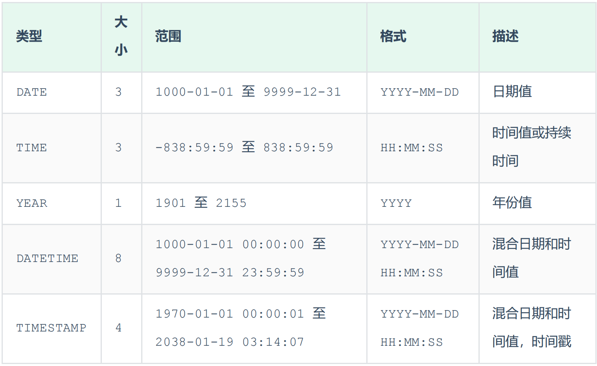
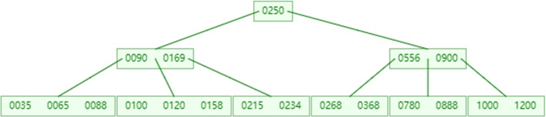

# MySql学习——基础篇

## 1、基本概念

数据库：

数据库管理系统：

SQL：

关系型数据库：


## 2、SQL操作

### DDL——数据库定义语言

数据库的操作

```sql
show databases;

select database(); #查询当前数据库

create database if not extists itcast default charset utf8mb4;

drop database if extists itcast;

use itcase;
```

表的操作

```sql
show tables;

create table user(
	id int comment '编号',
    name varchar(50) comment '姓名',
    age int comment '年龄'
)comment '用户表'

desc user;

show create table user;
```

mysql数据库中字段的类型主要就三类，数值类型、字符类型、日期类型。

数值类型：

```
TINYINT SMALLINT MEDIUMINT INT BIGINT FLOAT DOUBLE 
1B		2B		 3B		   4B  8B  	  4B   	8B
```

字符串类型


日期类型



例子

```sql
create table user(
	id int comment '编号',
    code char(10) comment '工号',
    name char(10) comment '姓名',
    gender char(5) comment '性别',
    age tinyint unsigned comment '年龄',
    idcard char(20) comment '身份证号',
    time date comment '入职时间'
)comment '员工表'
```

表的操作

```sql

```

### DML——数据库操作语言（增删改）

```sql
insert into user (username, password, nickname, email, create_time, update_time) value ('文帅', 'wenshuai', 'wenshuai', '7777', now(), now())

insert into user (username, password, nickname, email, create_time, update_time) value ('文帅', 'wenshuai', 'wenshuai', '7777', now(), now()),
	  ('文帅', 'wenshuai', 'wenshuai', '7777', now(), now()),
	  ('文帅', 'wenshuai', 'wenshuai', '7777', now(), now())
      
update user set username = 'new文帅' where id = 6;

delete from user where id = 6;
```

### DQL——数据库查询语言

```
SELECT
	字段列表
FROM
	表名列表
WHERE
	条件列表
GROUP BY
	分组字段列表
HAVING
	分组后条件列表
ORDER BY
	排序字段列表
LIMIT
	分页参数
```


```
select id as '序号', workno as '工号' from emp;
```


注意这里的占位符

```sql
select * from emp where idcard like '%x'
select * from emp where idcard like '________________x'
```

**聚合函数**

```
count max min avg sum
```

```
count(*)是统计表中记录的数量的。

count(1)是统计满足条件的记录的数量的。

当然事实上我直接测试上面二者，结果上没有区别

count(字段)是统计这个字段不为null的数量的。
```

select avg(age) from emp;

select max(age) from emp;

**分组查询**

group by通常和having一起使用，where和having的区别如下：

+ 执行的顺序不同。先是where根据条件对所有的数据进行筛选，然后再根据group by进行分组，然后再是having对分组后的组根据条件进行筛选；
+ 判断的条件不同，where只能对原始记录进行判断，不能对聚合函数进行判断，而having可以对聚合函数进行判断

select gender, count(*) from emp group by gender;

select gender, avg(age) from emp group by gender;

```sql
# 查询年龄小于45的员工 , 并根据工作地址分组 , 获取员工数量大于等于3的工作地址
select workaddress, count(*) from emp where age < 45 group by workaddress having count(*) >= 3;
```

**排序查询**

select * from emp order by age asc;

select * from emp order by age desc;

需要注意的是order by的执行顺序，是在having之后的，也就是分组完，并且筛选分组之后，才进行order。

**分页查询**

分页查询的语法很简单

select * from emp order by age desc limit 0, 10;

limit pagestartindex, pagesize;


一定要注意这个执行顺序，简而言之就是，先通过where对所有数据进行筛选，然后进行分组，然后通过聚合函数等对分组进行筛选，筛选完成之后就可以进行排序和分页了。

### DCL数据控制语言

略


## 3、函数

略


## 4、约束


## 5、多表查询


# MySql学习——进阶篇

一、存储引擎

二、索引

三、SQL优化

四、视图、存储过程、触发器

五、锁

六、InnoDB引擎

七、MySQL管理

## 一、存储引擎

**mysql架构：**


连接层：主要负责与数据库驱动交互，需要做一些授权认证、网络协议解析等工作；

服务层：完成sql的解析和优化，判断是否利用索引，生成执行计划等；

引擎层：通过调用存储层的API，真正的去完成数据的读取和存储等操作。在数据库中，索引是在引擎层实现的。

存储层：通过调用系统调用，来讲数据具体的存到磁盘或者文件系统中。

mysql的特殊之处和优势在于，插拔式的存储引擎选择，可以根据具体场景的需要选择合适的存储引擎，而不需要变动数据的设计和操作。如innodb、memory、myisam引擎。

```
create table biaoming (

) engine = innodb 
show engines;
show create table biaoming;
```

**innodb：**

特点就三个：事务、外键、行级锁。xxx.ibd：xxx代表的是表名，innoDB引擎的每张表都会对应这样一个表空间文件，存储该表的表结 构（frm-早期的 、sdi-新版的）、数据和索引。存储的逻辑结构如下：


表空间 : InnoDB存储引擎逻辑结构的最高层，ibd文件其实就是表空间文件，在表空间中可以包含多个Segment段。

+ 段 : 表空间是由各个段组成的， 常见的段有数据段、索引段、回滚段等。InnoDB中对于段的管理，都是引擎自身完成，不需要人为对其控制，一个段中包含多个区。

+ 区 : 区是表空间的单元结构，每个区的大小为1M。 默认情况下， InnoDB存储引擎页大小为16K， 即一个区中一共有64个连续的页。

+ 页 : 页是组成区的最小单元，**页也是****InnoDB** **存储引擎磁盘管理的最小单元**，每个页的大小默认为 16KB。为了保证页的连续性，InnoDB 存储引擎每次从磁盘申请 4-5 个区。

+ 行 : InnoDB 存储引擎是面向行的，也就是说数据是按行进行存放的，在每一行中除了定义表时所指定的字段以外，还包含两个隐藏字段(后面会详细介绍)。

myisam:

不支持外键、支持表锁不支持行锁、访问速度快；

memory：

Memory引擎的表数据时存储在内存中的，由于受到硬件问题、或断电问题的影响，只能将这些表作为 临时表或缓存使用。内存存放、hash索引（数组+链表）。

## 二、索引

**概述：**

存储引擎是什么：存储引擎是数据实现增删改查的具体方式，数据是怎样存入的，怎么读取的。

索引是什么：存储引擎所使用的具体数据结构，这就被称为索引。索引就是帮助存储引擎高效获取数据的数据结构。

| **优势**                                                     | **劣势**                                                     |
| ------------------------------------------------------------ | ------------------------------------------------------------ |
| 提高数据检索的效率，降低数据库的IO成本                       | 索引列也是要占用空间的。                                     |
| 通过索引列对数据进行排序，降低数据排序的成本，降低CPU的消耗。 | 索引大大提高了查询效率，同时却也降低更新表的速度， 如对表进行INSERT、UPDATE、DELETE时，效率降低。 |

**索引结构:**

innodb的索引结构是B+树，memory的索引结构是hash表。因此我们重点来看一看B树和B+树的结构以及其在面对插入时的情况。首先是B树的情况。简而言之，就是先确定一个Key值，比如这个k值是4，就代表树中每一个节点，能存放4条记录，因此就能存放5个指针。在插入时，就按照排序二叉树的方法找到这条记录要插入的节点。如果插入之后，这个节点的记录数已经超过了4，即变成5了，就代表需要进行向上裂变。因此就把这个节点中的中间这个节点放到其父亲节点身上，然后这个节点进行裂变。不断递归向上裂变。



在理解B树的原理之后，再看来看看InnoDB引擎的B+树。一个关键的不同是，只在叶子节点上存储记录，其它内部节点统统都不存储记录。另外需要把所有叶子节点连接起来，形成一个双相循环链表。


**索引分类：**

根据索引的具体类型，可以分为：主键索引、唯一索引、常规索引、全文索引。

| **分类** | **含义**                                             | **特点**                 | **关键字** |
| -------- | ---------------------------------------------------- | ------------------------ | ---------- |
| 主键索引 | 针对于表中主键创建的索引                             | 默认自动创建, 只能有一个 | PRIMARY    |
| 唯一索引 | 避免同一个表中某数据列中的值重复                     | 可以有多个               | UNIQUE     |
| 常规索引 | 快速定位特定数据                                     | 可以有多个               |            |
| 全文索引 | 全文索引查找的是文本中的关键词，而不是比较索引中的值 | 可以有多个               | FULLTEXT   |

这里需要注意的是，一般主键索引会自动默认创建，并且只能有一个，而且是聚簇索引，即在叶子节点中，存放的是完整的记录数据。而除了聚簇索引以外，其它索引都只会在叶子节点中存放索引列以及主键id，因为可以节省存储空间。

根据索引的存储形式，可以分为：聚集索引、二级索引

| **分类**                  | **含义**                                                   | **特点**            |
| ------------------------- | ---------------------------------------------------------- | ------------------- |
| 聚集索引(Clustered Index) | 将数据存储与索引放到了一块，索引结构的叶子节点保存了行数据 | 必须有,而且只有一个 |
| 二级索引(Secondary Index) | 将数据与索引分开存储，索引结构的叶子节点关联的是对应的主键 | 可以存在多个        |

聚集索引选取规则:

如果存在主键，主键索引就是聚集索引。

如果不存在主键，将使用第一个唯一（UNIQUE）索引作为聚集索引。此时唯一索引就被升级为了聚集索引，即叶子节点将会存储完整记录数据。

如果表没有主键，或没有合适的唯一索引，则InnoDB会自动生成一个rowid作为隐藏的聚集索引。同理。

**索引语法：**

```sql
# 创建索引
create index idx_name on user(name);
create index idx_name_age on user(name,age); #联合索引，需要遵循最左前缀原则

show index from user;

drop index idx_name on user;
```


**SQL性能分析：**

查看执行频次，以有针对的进行优化。

```
--解释一下这条语句。Global status就是全局状态变量，LIKE就是对这些全局状态变量进行匹配。
SHOW GLOBAL STATUS LIKE 'Com	';
```

慢查询日志

慢查询日志会记录所有执行用时超过了指定值的语句的执行日志。慢查询日志默认没有开启，可以使用下来查看开启状态：

```sql
show variable like 'slow_query_log';
```

如果需要开启慢查询日志，需要在my.cnf配置文件中配置

```
1	# 开启MySQL慢日志查询开关

2	slow_query_log=1

3	# 设置慢日志的时间为2秒，SQL语句执行时间超过2秒，就会视为慢查询，记录慢查询日志

4	long_query_time=2

tail -f localhost-slow.log
```

profile详情

show profiles能够在做sql优化时帮助我们了解时间都耗费到哪里去了。通过set profiling = 1;来开启profile操作。接下来我们所执行的sql语句，都会被记录，并且记录时间消耗到哪里去了。通过show profiles查看。

```

show profiles;

show profiles for query query_id;

show profile cpu for query query_id;
```

explain语句

通过explain语句可以查看这条sql语句的执行计划。Explain 执行计划中各个字段的含义:

| **字段**     | **含义**                                                     |
| ------------ | ------------------------------------------------------------ |
| id           | select查询的序列号，表示查询中执行select子句或者是操作表的顺序(id相同，执行顺序从上到下；id不同，值越大，越先执行)。 |
| select_type  | 表示 SELECT 的类型，常见的取值有 SIMPLE（简单表，即不使用表连接或者子查询）、PRIMARY（主查询，即外层的查询）、  UNION（UNION 中的第二个或者后面的查询语句）、  SUBQUERY（SELECT/WHERE之后包含了子查询）等 |
| type         | 表示连接类型，性能由好到差的连接类型为NULL、system、const、  eq_ref、ref、range、 index、all 。 |
| possible_key | 显示可能应用在这张表上的索引，一个或多个。                   |
| key          | 实际使用的索引，如果为NULL，则没有使用索引。                 |
| key_len      | 表示索引中使用的字节数，  该值为索引字段最大可能长度，并非实际使用长度，在不损失精确性的前提下，  长度越短越好 。 |
| rows         | MySQL认为必须要执行查询的行数，在innodb引擎的表中，是一个估计值， 可能并不总是准确的。 |
| filtered     | 表示返回结果的行数占需读取行数的百分比，  filtered 的值越大越好。 |

感觉需要记住的是首先是id，执行顺序。其次技术查询类型，简单、主查询、子查询、联合等。再记住可能使用的索引。事实上使用的索引。


**索引的使用：**

```
创建索引:
create index idx_name on user_table(username);

```


**最左前缀法则：**

如果使用多列索引（联合索引），那么索引的使用就遵循最左前缀法则。即在条件where中，如果条件中某一个条件不是联合索引中的列，那么从这个条件开始的右边所有条件的索引都将不再生效。即只有条件中连续的最左边的索引列会生效。比如我们创建一个联合索引

```
create index idx_pro_age_name on user(profession, age, username);
```

然后数据库会创建一个有三个索引列的联合索引 idx_pro_age_name；然后如果我们使用语句：

```
select * from user where profession = '软件工程'
```

这个联合索引是会生效的，但是只会部分生效，只会生效profession的部分。再看如下的语句：

```
select * from user where gender = '1' and profession = '软件工程'
```

在gender上并没有设置索引，那么这整个语句都将不会走索引。即使profession有一个联合索引。

为什么会发生这样的情况？为什么存在最左前缀法则，而不是最右前缀法则或者其他的什么法则？这里我们就要搞清楚联合索引的存储结构。实际上它的主体结构仍是B+树，但是在每个节点中，都会存储所有的索引列信息，在插入或者查找时，会先根据前面的索引，在前面的索引相同的情况下，才会使用后面的索引作为查询条件。


**范围查询：**
